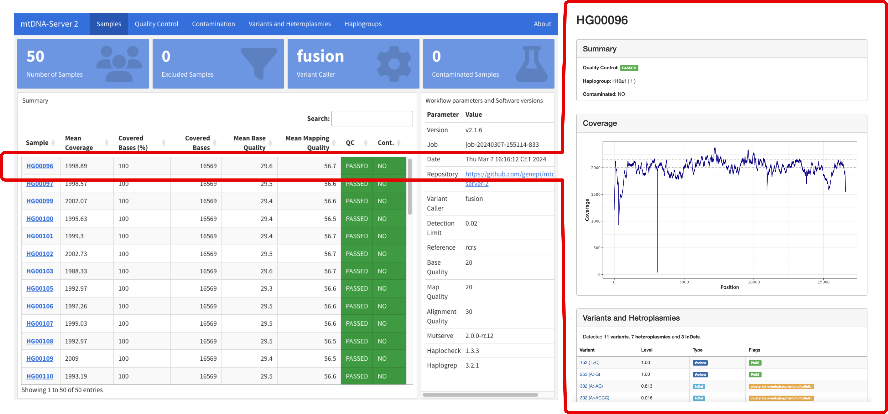

# mtDNA-Server 2

[](https://github.com/genepi/mtdna-server-2/actions/workflows/run-tests.yml)
[](https://github.com/askimed/nf-test)

mtDNA-Server 2 is a Nextflow DSL2 pipeline to accurately detect heteroplasmic and homoplasmic variants in mitochondrial (mtDNA) genomes, details can be found in our [NAR publication](https://doi.org/10.1093/nar/gkae296). 



### Documentation
The documentation can be accessed [here](https://mitoverse.readthedocs.io/mtdna-server/mtdna-server/). 

## Citation
Weissensteiner H*, Forer L*, Kronenberg F, Schönherr S. [mtDNA-Server 2: advancing mitochondrial DNA analysis through highly parallelized data processing and interactive analytics](https://doi.org/10.1093/nar/gkae296). Nucleic Acids Res. 2024 May 6:gkae296. doi: 10.1093/nar/gkae296. Epub ahead of print. PMID: 38709886.

## Version History

Release [v2.1.15](../../releases/tag/v2.1.15) - Add option for min mean coverage

Release [v2.1.14](../../releases/tag/v2.1.14) - Load resource conf

Release [v2.1.13](../../releases/tag/v2.1.13) - Update to latest Haplogrep3 

Release [v2.1.12](../../releases/tag/v2.1.12) - Install Haplogrep3 tree directly.

Release [v2.1.11](../../releases/tag/v2.1.11) - Improve QC command, update to latest mutserve v2.0.1.

Release [v2.1.10](../../releases/tag/v2.1.10) - Improved mutect2 support: create missing RG tags, write inidividual reference sequence on the fly, support complex ref tags.

# BU SCC Instructions

[INC20738179](https://bu.service-now.com/now/nav/ui/classic/params/target/incident.do%3Fsys_id%3D0d34ff11835c7e1076b75ddfeeaad30c)
* Error message: `Failed to pull singularity image`
* Root cause/issue: the container build was initiated on a node not configured for container building
* Solution Provided: instructions for
1. Building Containers
2. Update the pipeline configuration to use the local image
3. Run the pipeline with the test profile

**Note:** the nextflow.config file has been updated to configure the pipeline to submit each task as a separate job. 

Requirements
* The required container has bee locally built and is saved in a "containers" folder - as described in the ticket
* The small input data file (`sample_S.bam`) has been downloaded to the working directory (same location as the main.nf)

Here are the commands for running the pipeline on the SCC:

```bash
cd /projectnb/ar-rcs/client/nmf35/INC20738179_Nextflow/aramp10_fork/mtdna-server-2
module load nextflow/25.04.7
# Submit each task as a job:
nextflow run main.nf -profile test,singularity -c mtdna-server-2.config
# Run the pipeline locally:
nextflow run main.nf -profile test,singularity -c mtdna-server-2.config -process.executor local
```


